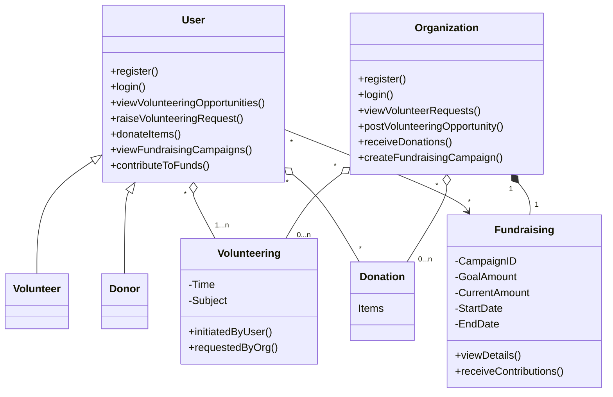

Project Name : CareWing App
Description :
CareWing is an innovative web application designed to bridge the gap between non-governmental organizations (NGOs) and individuals eager to contribute to the welfare of children—a cause recognized as one of the critical issues by the United Nations. This platform facilitates a collaborative environment where users can offer their expertise by teaching subjects or courses of their choice at their convenience. These educational volunteer opportunities are made visible to NGOs within the user's local area, enabling a direct and impactful connection with the communities they serve.

Beyond educational contributions, CareWing empowers individuals to donate items that are no longer needed, ensuring these goods reach children and families who can benefit most. From books to clothes, toys to technology, the platform streamlines the process of giving, making it easier for users to declutter responsibly while supporting meaningful causes.

Recognizing the ongoing financial needs of NGOs dedicated to children's welfare, CareWing also features a fund-raising module. This critical component allows NGOs to highlight their financial campaigns to a broad audience of potential donors, detailing their goals and the impact contributions will make. Users can browse these campaigns and choose to contribute financially, offering a seamless way to support monetary needs with transparency and trust.

At its core, CareWing is more than just a platform; it's a community of change-makers committed to making a difference in the lives of children. By leveraging technology, CareWing aims to facilitate a powerful synergy between NGOs and the general public, fostering a culture of generosity, education, and support that reaches directly into the heart of communities in need. Through CareWing, every individual has the opportunity to contribute to a brighter future for children, making it an essential tool for anyone looking to impact the world positively.

Team Details:
Srivardhan karanam - karanam.sr@northeastern.edu
Rishika Harish - harish.ris@northeastern.edu
Indrayani - lnu.in@northeastern.edu
Lok Venkatesh Vasamsetti - vasamsetti.l@northeastern.edu

#Object model

  
